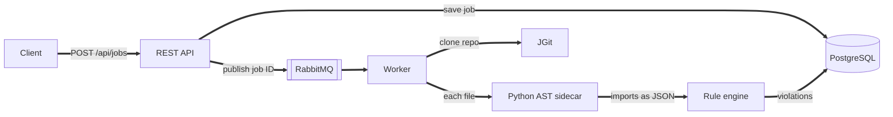

# ArchGuard

**An event-driven architectural linter that catches design-level violations, not just style issues.**

Most linters check lines of code. ArchGuard checks the structure of a system: which layers are allowed to talk to each other, and whether modules depend on each other in cycles. Analysis runs asynchronously on a job queue, so large repositories never block the API.

> 🚧 **Ongoing project.** The async pipeline works end to end for Python repositories. Cycle detection and GitHub PR reporting are in progress.

## How it works



1. The API stores a `PENDING` job and pushes its ID to RabbitMQ.
2. A worker clones the repository and sends each file to a language sidecar.
3. The sidecar parses the file with native tooling and returns a common JSON format.
4. The rule engine checks the result and saves any violations.

**Why a sidecar?** Each language is parsed by its own native parser, which is more accurate than parsing everything from Java. Because every sidecar returns the same JSON, the rule engine stays language agnostic.

## Current rule

**`DB_CALL_IN_VIEW_LAYER`**: a view file imports a database driver (`sqlite3`, `sqlalchemy`, `psycopg2`) directly instead of going through the data layer.

## Tech stack

Java 17 · Spring Boot 3 · RabbitMQ · PostgreSQL · JGit · Python `ast` · Docker · GitHub Actions

## Quick start

**Requirements:** JDK 17, Maven, Docker, Python 3

```bash
cp .env.example .env          # then set your own passwords
docker compose up -d          # starts PostgreSQL and RabbitMQ
mvn spring-boot:run           # run from the repository root
```

Submit a job. This repo contains a test fixture with a deliberate violation, so it can analyze itself:

```bash
curl -X POST http://localhost:8080/api/jobs \
  -H "Content-Type: text/plain" \
  -d "https://github.com/Maheesh09/ArchGuard.git"
```

The worker log should report a `DB_CALL_IN_VIEW_LAYER` violation in `src/test/resources/views/test_view.py` at line 2.

Run the tests with `mvn test`.

## Roadmap

- [x] Async job pipeline with RabbitMQ and PostgreSQL
- [x] Python AST sidecar and first layer rule
- [ ] Dependency graph and circular dependency detection (Tarjan's SCC)
- [ ] Layer rules configured per repository through `archguard.yml`
- [ ] GitHub App with signed webhooks and PR reports
- [ ] Separate, horizontally scaled workers with retries and a dead letter queue
- [ ] .NET Roslyn sidecar

## Author

Built by [Maheesha Pramuditha](https://www.linkedin.com/in/maheeshapramuditha)
